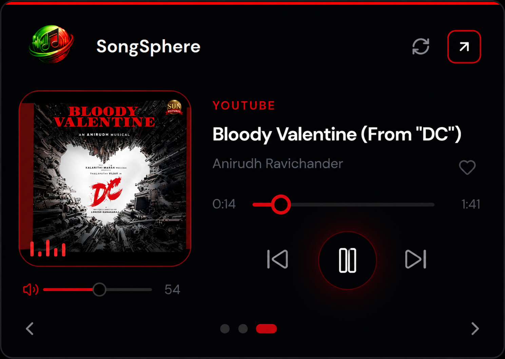
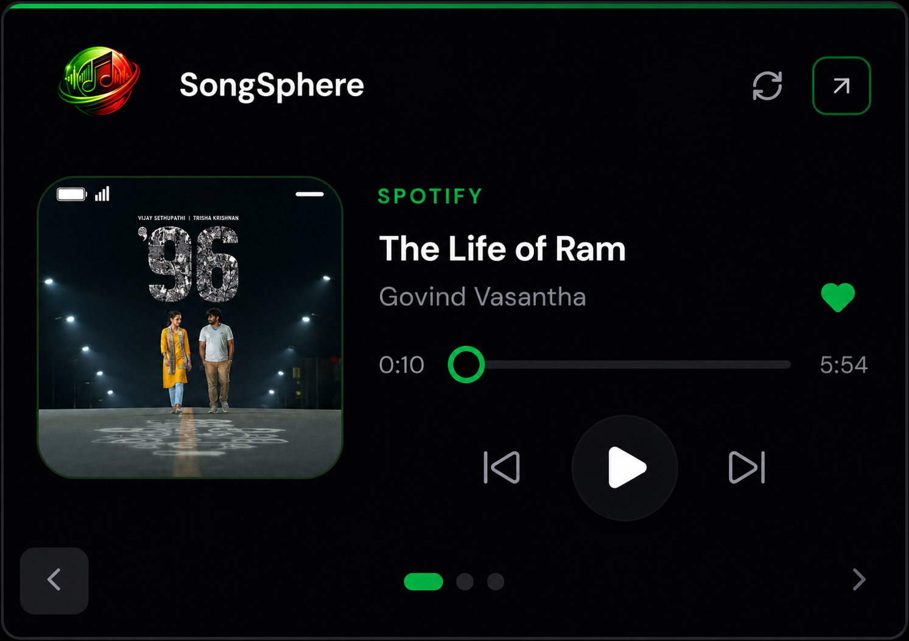
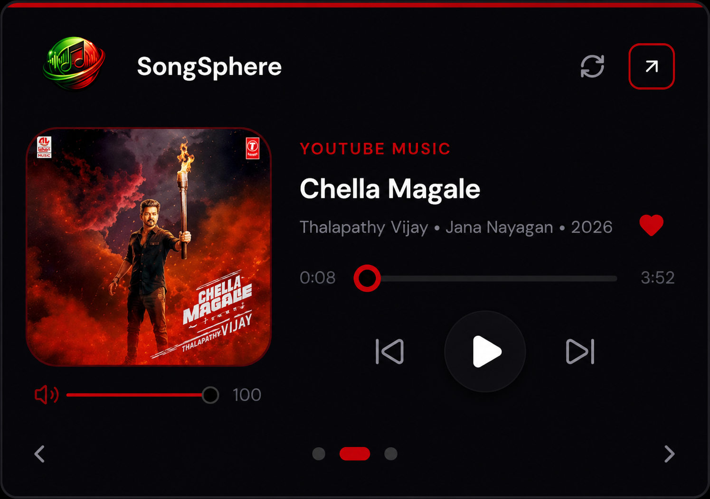

# SongSphere

Universal multi-session media controller for the browser - Spotify, YouTube Music, YouTube and generic HTML5 players.

SongSphere is an independent open-source project and is not affiliated with Spotify, YouTube, Google or any music platform.

Built with **WXT · React · TypeScript · Tailwind · Zustand**.

## Features

- **Multi-session control** - see and switch between every playing tab from one popup
- Play / pause / seek / volume / like (per-platform capabilities)
- Global keyboard shortcuts (Alt+Shift+P / arrows / L)
- Chrome and Firefox builds
- Local-only - no backend, no analytics

## Gallery

<!--
The previous Gallery used markdown tables with plain text placeholders, so nothing rendered.
Use an HTML table +  tags for reliable multi-column layout on GitHub.
-->

<table>
  <tr>
    <th>Spotify</th>
    <th>YouTube</th>
    <th>YouTube Music</th>
  </tr>
  <tr>
    <td align="center">
      
    </td>
    <td align="center">
      
    </td>
    <td align="center">
      
    </td>
  </tr>
</table>

## Install

```bash
git clone https://github.com/AaronKurian/SongSphere.git
cd SongSphere
npm install
```

`npm install` runs `wxt prepare` automatically and generates TypeScript types in `.wxt/`.

Optional typecheck:

```bash
npm run compile
```

---

## Development (hot reload)

Use this while changing UI or extension code. **Keep the dev terminal open** the whole time - the dev server must stay running.

### Firefox (recommended if that is your main browser)

```bash
npm run dev:firefox
```

1. Wait for `Started dev server @ http://localhost:3000`.
2. Firefox opens (or go to `**about:debugging**` → **This Firefox** → **Load Temporary Add-on**).
3. Select `**.output/firefox-mv2/manifest.json`** inside the project folder.

**Reload after changes**

| What you changed                | What to do                                                          |
| ------------------------------- | ------------------------------------------------------------------- |
| Popup UI (`src/popup/`, styles) | Close and reopen the SongSphere popup                               |
| Background / content scripts    | **Reload** the extension in `about:debugging`                       |
| `manifest` / `wxt.config.ts`    | Stop dev (`Ctrl+C`), run `npm run dev:firefox` again, reload add-on |

**Landing page (marketing site)**

- [http://localhost:3000/landing.html](http://localhost:3000/landing.html)
- [http://localhost:3000/privacy.html](http://localhost:3000/privacy.html)
- [http://localhost:3000/license.html](http://localhost:3000/license.html)
- Dev server must be running (`npm run dev` or `npm run dev:firefox`).

**Popup dev note:** The popup loads from the Vite dev server. If you see connection errors, confirm the terminal is still running and the port is **3000**.

### Chrome / Chromium

```bash
npm run dev
```

1. Open `**chrome://extensions**` (or `edge://extensions`).
2. Enable **Developer mode**.
3. **Load unpacked** → choose `**.output/chrome-mv3`** (created after dev starts).

Reload rules are the same as Firefox (popup vs background vs full restart).

---

## Production build (permanent / daily use)

This build **does not** need `npm run dev` running. Load it once and use it like a normal unpacked extension until you rebuild.

### Firefox

```bash
npm run build:firefox
```

1. `**about:debugging**` → **This Firefox** → **Load Temporary Add-on**.
2. Select `**.output/firefox-mv2/manifest.json`**.

The add-on stays loaded until you remove it or restart Firefox (temporary add-ons are cleared on Firefox restart unless you use a persistent dev setup).

For a **long-lived local install**, reload the same folder after each `npm run build:firefox`; pin SongSphere to the toolbar.

### Chrome

```bash
npm run build
```

1. `**chrome://extensions**` → Developer mode → **Load unpacked**.
2. Folder: `**.output/chrome-mv3`**.

Click **Reload** on the extension card after rebuilding.

### Store-ready zip (optional)

```bash
npm run zip:firefox   # → .output/songsphere-x.x.x-firefox.zip
npm run zip           # → Chrome MV3 zip
```

---

## Using SongSphere

1. Open a supported player in a tab:
  - [Spotify Web Player](https://open.spotify.com)
  - [YouTube Music](https://music.youtube.com)
  - [YouTube](https://www.youtube.com) (watch page with video playing)
  - Other sites with HTML5 / Media Session (limited controls)
2. Start playback on that tab.
3. Click the **SongSphere** toolbar icon.
4. Switch sessions with the bottom dots or chevrons; control playback from the popup.

**Shortcuts** (when the browser has focus):

| Shortcut    | Action                 |
| ----------- | ---------------------- |
| Alt+Shift+P | Play / pause           |
| Alt+Shift+→ | Next track             |
| Alt+Shift+← | Previous track         |
| Alt+Shift+L | Like (where supported) |

---

## Project layout

```
src/
  entrypoints/       # background, content scripts, popup, landing page
  popup/             # React popup UI
  landing/           # Marketing landing page
  background/        # Session bridge, messaging
  isolated/          # Per-platform adapters
  shared/            # Types, constants
  styles/            # globals.css
public/icon/         # Extension icons (regenerate: python3 scripts/gen-icons.py)
assets/              # Branding (songsphere.png, etc.)
```

Docs: [docs/ARCHITECTURE.md](docs/ARCHITECTURE.md) · [PRIVACY.md](PRIVACY.md) · [docs/STORE.md](docs/STORE.md)

---

## Troubleshooting

`**NS_ERROR_CONNECTION_REFUSED` / popup blank in dev**  
Dev server is not running or the wrong port. Run `npm run dev:firefox` (or `npm run dev`) and leave it open. Use port **3000**.

**Extension does nothing after install**  
Open a supported site, play audio, then open the popup. Reload the extension after `build` if you changed background code.

**Icons look tiny in Firefox**  
Rebuild and reload the extension; toolbar icons are set on background startup.

**Dev telemetry overlay**  
In the popup console: `localStorage.setItem("songsphere:dev", "1")` then reopen the popup.

---

## License

This project is licensed under the MIT License - see the [LICENSE](LICENSE) file for details.

Made with ❤️ by Aaron Kurian Abraham
